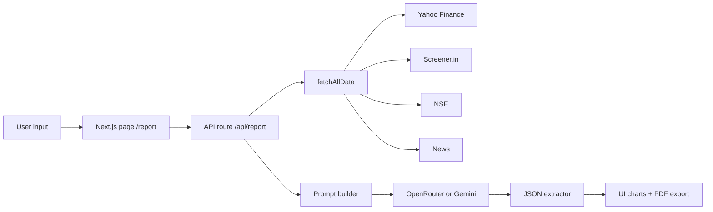

# StockIQ - Institutional Stock Research App

StockIQ is an AI-powered equity research dashboard for Indian stocks (NSE/BSE). It combines live market data with LLM analysis to produce structured, institutional-style research reports in seconds.

## Table of contents
- What hedge funds do
- Hedge fund research workflow
- How this project works
- Architecture and data flow
- API contract and data shape
- Local setup and environment
- Extending the data mappings
- Troubleshooting
- Disclaimer

---

## What hedge funds do

Hedge funds are private investment partnerships that seek to generate alpha (returns above a benchmark) by using flexible strategies and sophisticated research. Typical traits:

1. Structure
   - Investors are limited partners; managers are general partners.
   - Capital is pooled and deployed across multiple strategies or a concentrated book.

2. Fees and incentives
   - Management fee (often ~2%) + performance fee (often ~20%).
   - High-water marks and hurdle rates align incentives and prevent fees on losses.

3. Strategy toolbox
   - Long/short equity: own undervalued companies, short overvalued ones.
   - Event-driven: mergers, demergers, restructurings.
   - Global macro: rates, currencies, commodities, geopolitical themes.
   - Relative value/arbitrage: price discrepancies across instruments.
   - Quant and stat-arb: algorithmic signals and mean reversion.

4. Risk management
   - Position sizing, sector limits, and liquidity checks.
   - Hedging via index futures, options, or pairs.
   - Stress testing and scenario analysis.

5. Execution
   - Prime brokers provide leverage, short locates, and financing.
   - Trading focuses on minimizing slippage and market impact.

---

## Hedge fund research workflow

Hedge fund research is designed to build a high-conviction investment thesis with clear catalysts and risk controls.

1. Idea generation
   - Screen for valuation gaps, growth inflections, or structural tailwinds.
   - Identify mispricings vs. consensus expectations.

2. Deep diligence
   - Financial statement analysis (income, balance sheet, cash flow).
   - Forensic checks (working capital, cash conversion, accruals).
   - Management quality and capital allocation track record.

3. Model building
   - Base/bear/bull projections.
   - DCF and multiple-based valuation.
   - Sensitivity analysis and scenario planning.

4. Variant view
   - Define what the market is missing and why it will re-rate.
   - Identify catalysts and the timeline for thesis realization.

5. Portfolio construction
   - Size positions by conviction, volatility, and correlation.
   - Use hedges to control factor exposures.

---

## How this project works

StockIQ automates large parts of that workflow using public data and an LLM, then presents the output as a structured, visual report.

1. User input
   - Enter company name (and optionally sector, price, market cap).
   - Optional overrides are used when live data is missing.

2. Data aggregation
   - The backend fetches data in parallel from Yahoo Finance, Screener.in, NSE, and Google News.
   - Results are merged into a single normalized object with data quality flags.

3. Prompt construction
   - A large prompt injects real numbers, financial history, and ratios.
   - The LLM is instructed to return only JSON with a strict schema.

4. LLM analysis and JSON recovery
   - Primary: OpenRouter (any supported model).
   - Fallback: Gemini direct.
   - A multi-step JSON extractor repairs common formatting issues.

5. Frontend rendering
   - The report is shown as a multi-tab dashboard with charts.
   - The report can be exported to PDF.

---

## Architecture and data flow



Key files
- pages/api/report.js: core pipeline (data fetch, prompt, LLM, JSON parsing)
- lib/fetchAllData.js: parallel data aggregation + normalization
- lib/fetchYahoo.js: Yahoo Finance data
- lib/fetchScreener.js: Screener.in scrape for 10y financials
- lib/fetchNSE.js: NSE live price + Google News RSS
- pages/index.js: search UI
- pages/report.js: report renderer
- components/ChartComp.js: Chart.js wrapper

---

## API contract and data shape

Endpoint: POST /api/report

Request body
```json
{
  "company": "Reliance Industries",
  "sector": "Energy & Oil & Gas",
  "price": "2800",
  "marketCap": "1800000"
}
```

Response (high-level shape)
```json
{
  "success": true,
  "data": {
    "company": { "name": "", "symbol": "", "rating": "BUY", "cmp": 0, "targetPrice": 0 },
    "scores": { "overall": 0, "businessQuality": 0, "managementQuality": 0 },
    "executiveSummary": { "oneLiner": "", "investmentThesis": "" },
    "businessOverview": { "whatItDoes": "", "revenueSegments": [] },
    "financials": { "revenueGrowth": [], "ebitdaGrowth": [], "patGrowth": [] },
    "valuation": { "dcf": {}, "multiples": {} },
    "risks": [],
    "verdict": { "action": "BUY", "why": "" },
    "_dataSources": ["Yahoo Finance", "Screener.in"],
    "_dataQuality": { "yahooOk": true, "screenerOk": true },
    "_fetchError": null,
    "_aiModel": ""
  }
}
```

Notes
- If a data source fails, the pipeline still returns a report with quality flags and a `_fetchError` message.
- LLM output is normalized with a JSON repair step to recover from truncation or malformed formatting.

---

## Local setup and environment

1. Install dependencies
```bash
npm install
```

2. Create .env.local
```env
GEMINI_API_KEY=your_gemini_key_here
OPENROUTER_API_KEY=your_openrouter_key
OPENROUTER_MODEL=google/gemini-2.5-flash
```

3. Start the dev server
```bash
npm run dev
```

Open http://localhost:3000

---

## Extending the data mappings

For better symbol resolution, add aliases for Indian companies in these maps:

1. Yahoo Finance symbols
   - lib/fetchYahoo.js -> NAME_TO_SYMBOL

2. Screener slugs
   - lib/fetchScreener.js -> SLUG_MAP

3. NSE symbols
   - lib/fetchNSE.js -> NSE_SYMBOLS

---

## Troubleshooting

1. "No API key configured"
   - Add GEMINI_API_KEY or OPENROUTER_API_KEY to .env.local and restart.

2. Empty or partial reports
   - One or more data sources may be blocked or rate-limited.
   - The report still renders but uses AI to fill gaps; see _dataQuality flags.

3. Screener or NSE fetch failures
   - These sources may block repeated requests. Try again later or add a proxy.

4. LLM JSON parsing errors
   - The extractor retries with multiple fixes; if it still fails, reduce output length or switch models.

---

## Disclaimer

This project is for educational and personal research only. It does not provide investment advice. Always verify numbers with official filings and licensed professionals.
