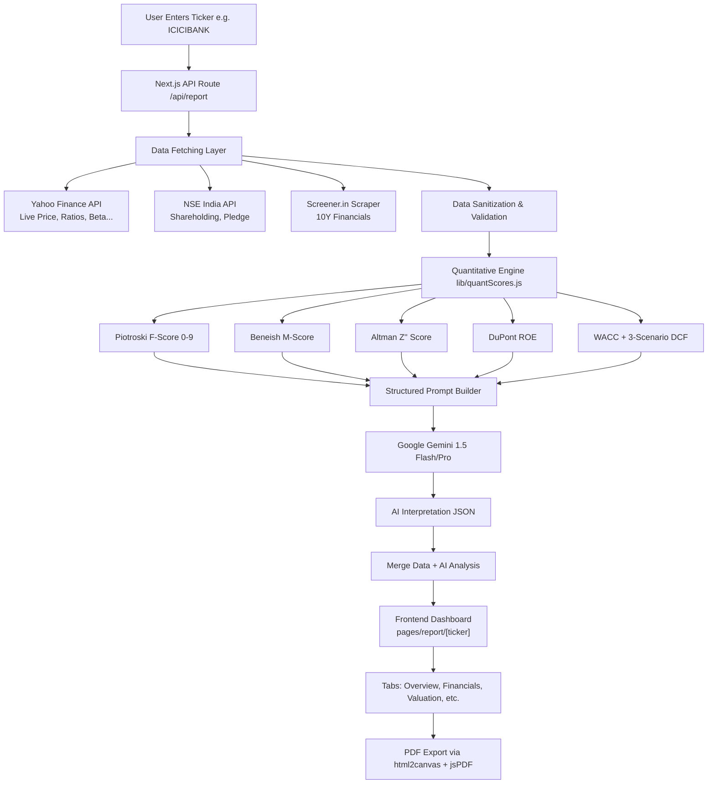

# StockIQ — Institutional Equity Research Engine for NSE/BSE

> AI-powered stock analysis tool that replicates hedge fund research methodology for Indian markets. Combines live market data, quantitative scoring models, and LLM interpretation to produce institutional-grade research reports.

**Live App:** [stock-iq-eight.vercel.app](https://stock-iq-eight.vercel.app)  
**Stack:** Next.js · Node.js · Google Gemini · Yahoo Finance · Recharts  
**Disclaimer:** Not investment advice. Not SEBI registered. For research and educational purposes only.


---

## Table of Contents

1. [What StockIQ Does](#1-what-stockiq-does)
2. [How It Works — End to End](#2-how-it-works--end-to-end)
3. [Data Fetching Architecture](#3-data-fetching-architecture)
4. [Quantitative Analysis Models](#4-quantitative-analysis-models)
5. [The AI Analysis Layer](#5-the-ai-analysis-layer)
6. [Frontend & Report Structure](#6-frontend--report-structure)
7. [Tech Stack](#7-tech-stack)
8. [Project Structure](#8-project-structure)
9. [Local Setup](#9-local-setup)
10. [Environment Variables](#10-environment-variables)
11. [API Reference](#11-api-reference)
12. [PDF Export](#12-pdf-export)
13. [Deployment](#13-deployment)
14. [Known Limitations](#14-known-limitations)

---

## 1. What StockIQ Does

Most retail investors in India have no access to the kind of research that institutional investors use. A Motilal Oswal or Kotak Institutional Equities research note costs thousands of rupees per year and requires a SEBI-registered broker account to access. StockIQ replicates this research process for free by:

- Fetching live and historical financial data from public sources
- Running five quantitative scoring models (Piotroski, Beneish, Altman, DuPont, Working Capital Cycle) in Node.js — not via AI
- Building a WACC-based DCF with Bear/Base/Bull scenarios using real assumptions
- Sending all pre-computed numbers to Google Gemini for interpretation only (not calculation)
- Rendering the full report as an interactive tabbed dashboard

**What makes this different from asking ChatGPT about a stock:**

The AI in StockIQ never calculates anything. All quantitative models run in JavaScript with real fetched data. The AI only explains the "why" behind numbers it receives. This eliminates hallucination of financial data — the single biggest failure mode of AI financial tools.

---

## 2. How It Works — End to End



---

## 3. Data Fetching Architecture

### Why multiple sources?

No single free source covers everything needed for a complete Indian equity analysis:

| Data Needed | Source | Why This Source |
|---|---|---|
| Live price, P/E, market cap, beta | Yahoo Finance (`yahoo-finance2` npm) | Real-time, reliable for NSE/BSE quotes |
| 10-year historical financials | Screener.in (scraper) | Best free source for long-term Indian financials |
| Shareholding pattern (quarterly) | NSE India public API | Official source, updated every quarter |
| Promoter pledge data | NSE India public API | Not available on Yahoo Finance |
| Recent news headlines | Google News RSS | Free, no API key needed |

### Fetching Priority & Fallbacks

```
For each data category:
  1. Try primary source
  2. If fails or returns null/zero → try secondary source
  3. If secondary also fails → mark as "DATA_UNAVAILABLE"
  4. NEVER pass null/zero to a financial calculation
     (0 in denominator = division by zero = garbage output)
```

### Data Sanitization Rules

Every value fetched goes through sanitization before being used:

```js
// Rule 1: Never let zero flow into division
const safeDiv = (numerator, denominator) => {
  if (!denominator || denominator === 0) return null;
  if (!numerator) return null;
  return numerator / denominator;
};

// Rule 2: Arrays with missing years use null, not 0
// [1200, 1450, null, 1890, 2100]  ← null for missing year
// NOT: [1200, 1450, 0, 1890, 2100]  ← 0 breaks ratios

// Rule 3: If a score cannot be computed, return a typed error
{ score: null, dataQuality: 'INSUFFICIENT', reason: 'CFO data unavailable' }
// NOT: { score: 0 }  ← 0/9 Piotroski is a real score, not an error
```

### NSE Ticker Format

Yahoo Finance requires `.NS` suffix for NSE stocks:

```
RELIANCE  →  RELIANCE.NS
HDFCBANK  →  HDFCBANK.NS
TCS       →  TCS.NS
```

BSE stocks use `.BO` suffix. The app auto-detects and appends the correct suffix.

---

## 4. Quantitative Analysis Models

All five models below run in Node.js using fetched financial data. **The AI does not run these calculations.** It receives the pre-computed results and explains them.

---

### 4.1 Piotroski F-Score (0–9)

**What it measures:** Overall fundamental quality of a company across profitability, leverage, and operating efficiency.

**How it works:** Nine binary questions. Each answer is either 0 (fail) or 1 (pass). Total is the F-Score.

**Interpretation:**
- 7–9: Strong fundamentals. Historically outperforms the market.
- 4–6: Moderate. Average quality business.
- 0–3: Weak fundamentals. High risk of underperformance.

**The 9 Signals:**

| # | Signal | Category | Formula | Pass Condition |
|---|---|---|---|---|
| 1 | ROA Positive | Profitability | PAT / Total Assets | > 0 |
| 2 | CFO Positive | Profitability | Operating Cash Flow | > 0 |
| 3 | ROA Improving | Profitability | ROA(t) vs ROA(t-1) | ROA increased YoY |
| 4 | Accruals Low | Profitability | CFO/Assets > PAT/Assets | Cash earnings > accounting earnings |
| 5 | Leverage Falling | Leverage | D/E(t) vs D/E(t-1) | Debt-to-equity decreased |
| 6 | Liquidity Improving | Leverage | Current Ratio(t) vs (t-1) | Current ratio increased |
| 7 | No Dilution | Leverage | Shares(t) vs Shares(t-1) | No new shares issued |
| 8 | Gross Margin Improving | Efficiency | GM%(t) vs GM%(t-1) | Margin expanded |
| 9 | Asset Turnover Improving | Efficiency | Revenue/Assets(t) vs (t-1) | Improved asset utilization |

**Signal 4 (Accruals) is the most important:** If CFO/Assets < PAT/Assets, the company is booking profits it hasn't actually collected in cash. This is often the first sign of earnings manipulation.

---

### 4.2 Beneish M-Score (Earnings Manipulation Detector)

**What it measures:** Probability that a company has manipulated its reported earnings.

**Threshold:** M-Score > –1.78 indicates possible manipulation.

**The 8 Variables:**

| Variable | Name | What It Detects |
|---|---|---|
| DSRI | Days Sales in Receivables Index | Receivables growing faster than revenue → may be booking phantom sales |
| GMI | Gross Margin Index | Deteriorating margins → pressure to manipulate |
| AQI | Asset Quality Index | More off-balance-sheet assets → aggressive capitalization |
| SGI | Sales Growth Index | High growth creates incentive to inflate further |
| DEPI | Depreciation Index | Slowing depreciation → extending asset lives to boost profits |
| SGAI | SG&A Index | Rising overhead relative to sales → operational deterioration |
| TATA | Total Accruals to Assets | High accruals = profits not backed by cash |
| LVGI | Leverage Index | Rising leverage → pressure to meet covenants via manipulation |

**M-Score Formula:**
```
M = -4.84 + (0.92 × DSRI) + (0.528 × GMI) + (0.404 × AQI)
         + (0.892 × SGI)  + (0.115 × DEPI) - (0.172 × SGAI)
         + (4.679 × TATA) - (0.327 × LVGI)
```

**Important:** TATA has the highest coefficient (4.679). High accruals are the single biggest predictor of earnings manipulation in this model.

**Historical accuracy:** The original Beneish research showed this model correctly identified manipulators like Enron before the fraud was discovered.

---

### 4.3 Altman Z-Score — Emerging Markets Version (Z'')

**What it measures:** Risk of financial distress or bankruptcy within 2 years.

**Why the Z'' version:** The original Altman Z-Score was designed for US manufacturing firms. The Z'' version (1995) was specifically created for emerging market companies and non-manufacturing firms — which makes it appropriate for Indian companies.

**Formula:**
```
Z'' = 6.56(X1) + 3.26(X2) + 6.72(X3) + 1.05(X4)

X1 = Working Capital / Total Assets
X2 = Retained Earnings / Total Assets
X3 = EBIT / Total Assets
X4 = Book Value of Equity / Total Liabilities
```

**Zones:**
```
Z'' > 2.6    →  SAFE ZONE      — Low bankruptcy risk
1.1 < Z'' < 2.6  →  GREY ZONE  — Moderate concern, monitor
Z'' < 1.1    →  DISTRESS ZONE  — High risk of financial distress
```

---

### 4.4 DuPont ROE Decomposition (3-Factor)

**What it measures:** *Why* a company has the ROE it does. Two companies can both have 20% ROE for completely different and non-equivalent reasons.

**Formula:**
```
ROE = Net Profit Margin × Asset Turnover × Equity Multiplier

Where:
  Net Profit Margin  = PAT / Revenue           (profitability)
  Asset Turnover     = Revenue / Total Assets  (efficiency)
  Equity Multiplier  = Total Assets / Equity   (leverage)
```

**Why this matters:**

| ROE Driver | What it means | Quality |
|---|---|---|
| High Net Profit Margin | Business has pricing power or cost advantages | High — sustainable |
| High Asset Turnover | Business is operationally efficient | Medium — can be competed away |
| High Equity Multiplier | ROE is boosted by debt | Low — leverage magnifies both gains and losses |

A company with 25% ROE driven by a 20% net margin is fundamentally different from one with 25% ROE driven by 10x leverage. DuPont makes this distinction explicit.

---

### 4.5 Working Capital Cycle

**What it measures:** How efficiently a company manages the cash tied up in its day-to-day operations.

**Components:**

```
DSO (Days Sales Outstanding)  = (Trade Receivables / Revenue) × 365
DIO (Days Inventory Outstanding) = (Inventory / COGS) × 365
DPO (Days Payable Outstanding)   = (Trade Payables / COGS) × 365

Cash Conversion Cycle (CCC) = DSO + DIO - DPO
```

**Interpretation:**

- **Low CCC** = Company collects from customers fast, holds inventory briefly, and takes long to pay suppliers. Cash-efficient. Examples: Retail chains like D-Mart (negative CCC).
- **High CCC** = Cash is locked in operations for a long time. Capital-intensive. Common in manufacturing.
- **Rising CCC over years** = Red flag. Customers paying slower, inventory building up, or suppliers cutting credit. Often precedes a cash flow crisis.

---

### 4.6 WACC Calculation

**Why this is critical:** A DCF without a properly calculated WACC is just fiction. Arbitrary discount rates (e.g., "10%") produce arbitrary valuations.

**Formula:**
```
WACC = (E/V × Ke) + (D/V × Kd × (1 - Tax Rate))

Where:
  E = Market Value of Equity (Market Cap)
  D = Total Debt
  V = E + D
  Ke = Cost of Equity (via CAPM)
  Kd = Cost of Debt
  Tax Rate = 25.17% (Indian corporate tax rate)
```

**Cost of Equity via CAPM:**
```
Ke = Rf + β × (Rm - Rf)

Where:
  Rf = Risk-Free Rate = India 10-Year G-Sec Yield (~7.0%)
  β  = Stock's Beta (fetched from Yahoo Finance)
  (Rm - Rf) = India Equity Risk Premium (~7.0%)
```

**Assumptions used:**
- Risk-free rate: 7.0% (approximate India 10Y G-Sec yield)
- Equity risk premium: 7.0% (based on Damodaran India ERP estimates)
- Cost of debt: 9.0% (approximate Indian corporate borrowing rate)
- Tax rate: 25.17% (base rate for domestic Indian companies)

---

### 4.7 DCF — Three Scenario Valuation

**What it measures:** Intrinsic value of the stock under three different assumptions about the future.

**Inputs:**
- Last year's Free Cash Flow (FCF = CFO – Capex)
- WACC (computed above)
- Three growth rate scenarios

**Scenarios:**

| Scenario | FCF Growth Rate (5Y) | Terminal Growth Rate | Condition |
|---|---|---|---|
| Bear | 5% | 4% | Business deteriorates, margin pressure |
| Base | 12% | 5% | Business grows in line with economy |
| Bull | 20% | 6% | Business expands, market share gains |

**DCF Formula:**
```
Intrinsic Value = PV(FCFs, Years 1-5) + PV(Terminal Value)

Terminal Value = FCF₅ × (1 + g) / (WACC - g)

PV of each FCF = FCFₙ / (1 + WACC)ⁿ
```

**Equity Value per Share:**
```
Equity Value = Enterprise Value - Net Debt
Price per Share = Equity Value / Shares Outstanding
```

**Sensitivity Matrix:** A 5×5 grid is rendered in the VALUATION tab showing intrinsic value across different combinations of growth rate (rows) and WACC (columns). Cells are color-coded green (undervalued vs CMP) to red (overvalued vs CMP).

---

## 5. The AI Analysis Layer

### Design Philosophy

**The AI is an interpreter, not a calculator.** This is the most important architectural decision in StockIQ.

Most AI financial tools ask the LLM to "analyze" a stock by providing just the company name. The AI then produces plausible-sounding but hallucinated financial data. StockIQ inverts this: all numbers are computed deterministically in Node.js first, then passed to the AI with explicit instructions to interpret — not generate — those numbers.

### What the AI Receives

The prompt injects:
- All five quantitative scores (already computed)
- 10 years of annual financials
- 8 quarters of quarterly financials
- Current valuation multiples
- Shareholding pattern with 8-quarter trend
- DCF results (Bear/Base/Bull)
- WACC assumptions
- 10 recent news headlines

### What the AI Is Asked to Do

Interpret, not calculate. Specifically:

- Explain *why* the Piotroski score is what it is for *this specific company*
- Flag which Beneish components are concerning and what they mean for this business
- Determine whether ROE is driven by genuine margins or by leverage (DuPont)
- Assess whether the CFO vs PAT trend shows earnings are being collected in cash
- Form a 2–3 sentence investment thesis backed by the data provided
- Identify specific risks (not generic industry risks)
- Provide a verdict: BUY / HOLD / SELL / AVOID

### What the AI Is Explicitly Forbidden From Doing

The system prompt contains these hard rules:

```
1. Never make up numbers. Use ONLY the data provided.
2. If data is missing or marked as null, say so. Do not estimate.
3. Every claim must reference a specific number from the data.
4. Do not use financial buzzwords: "robust", "synergies", "headwinds",
   "tailwinds", "well-positioned". Say specifically what you mean.
5. Identify contradictions in the data. If PAT is growing but CFO
   is declining, flag this explicitly — do not smooth over it.
```

### Output Format

The AI returns a single JSON object. Structured output eliminates markdown parsing and enables the frontend to render each field in the appropriate component.

```json
{
  "executiveSummary": {
    "oneLiner": "string",
    "investmentThesis": "string",
    "keyRisk": "string",
    "verdict": "BUY | HOLD | SELL | AVOID",
    "confidenceLevel": "HIGH | MEDIUM | LOW",
    "targetPrice12M": number
  },
  "businessOverview": {
    "businessModel": "string",
    "competitiveMoat": "string",
    "moatStrength": "STRONG | MODERATE | WEAK | NONE",
    "capitalAllocationQuality": "string",
    "managementRedFlags": ["string"]
  },
  "financialAnalysis": {
    "revenueQuality": "string",
    "marginAnalysis": "string",
    "balanceSheetStrength": "string",
    "earningsQuality": {
      "piotroskiInterpretation": "string",
      "beneishInterpretation": "string",
      "cfoPatAnalysis": "string"
    },
    "dupontInsight": "string"
  },
  "valuationAnalysis": {
    "multipleAssessment": "string",
    "dcfInterpretation": "string",
    "relativeValuation": "string",
    "marginOfSafety": "string"
  },
  "riskMatrix": [
    {
      "risk": "string",
      "description": "string",
      "severity": "HIGH | MEDIUM | LOW",
      "probability": "HIGH | MEDIUM | LOW"
    }
  ],
  "altmanZInterpretation": "string",
  "shareholdingInsight": "string",
  "catalysts": {
    "positive": ["string"],
    "negative": ["string"]
  },
  "overallScore": {
    "businessQuality": number,
    "financialHealth": number,
    "valuation": number,
    "management": number,
    "overall": number
  }
}
```

---

## 6. Frontend & Report Structure

### Report Tabs

The report is organized into six tabs. Each tab is a separate component that receives the full report object as props.

#### Tab 1: OVERVIEW
- Score strip: Business / Financial / Valuation / Management / Overall (each out of 10)
- Verdict badge: BUY / HOLD / SELL / AVOID
- Investment thesis (AI-written, backed by computed data)
- 12-month target price, confidence level, primary risk
- Company description
- Business overview: model, moat, capital allocation, red flags

#### Tab 2: FINANCIALS
- Revenue + EBITDA Margin chart (Recharts `ComposedChart`, bar + line, dual Y-axis)
- PAT vs CFO chart (the most important earnings quality chart — divergence = red flag)
- ROCE trend (10-year bar chart)
- Working capital table: DSO / DIO / DPO / CCC
- DuPont breakdown bar chart: three components of ROE shown proportionally
- Quarterly toggle: all charts switch between annual and quarterly view

#### Tab 3: VALUATION
- DCF table: Bear / Base / Bull intrinsic value + upside % vs current price
- WACC assumption table (transparent inputs)
- 5×5 sensitivity matrix: intrinsic value across growth rates × discount rates, color-coded
- Multiple commentary: P/E and EV/EBITDA vs estimated sector average

#### Tab 4: FORENSICS
- Piotroski F-Score: table of all 9 signals with Pass/Fail and description
- Beneish M-Score: 8 components with values and interpretation
- Altman Z-Score: 4 components, final score, zone indicator
- CFO vs PAT chart (same as Financials tab, placed here for forensic context)
- Red flags list from AI

#### Tab 5: SHAREHOLDING
- Stacked area chart: Promoter / FII / DII / Public over 8 quarters
- Promoter pledge % line overlay
- AI interpretation of shareholding trends

#### Tab 6: RISKS
- Risk matrix table: risk name / severity / probability / description
- Positive catalysts list
- Negative catalysts list

---

## 7. Tech Stack

| Category | Technology | Version | Purpose |
|---|---|---|---|
| Framework | Next.js | 14.x | Full-stack React framework, handles both frontend and API routes |
| Language | JavaScript (ES2022) | — | Used throughout (no TypeScript) |
| Styling | Tailwind CSS | 3.x | Utility-first CSS; overridden by CSS variables for theme |
| Charts | Recharts | 2.x | React-native charts (ComposedChart, BarChart, LineChart, AreaChart) |
| AI Model | Google Gemini 2.0 Flash | Latest | LLM for analysis interpretation (fast, free tier available) |
| Gemini SDK | @google/generative-ai | Latest | Official Google SDK for Gemini API calls |
| Market Data | yahoo-finance2 | Latest | Yahoo Finance wrapper for live NSE/BSE quotes |
| Web Scraping | cheerio | 1.x | HTML parsing for Screener.in financial data |
| HTTP Client | axios | 1.x | HTTP requests for NSE API and news feeds |
| PDF Export | jsPDF + html2canvas | Latest | Client-side PDF generation from rendered HTML |
| Fonts | Google Fonts | — | Instrument Serif + IBM Plex Mono + DM Sans |
| Deployment | Vercel | — | Zero-config Next.js deployment |

### Why These Choices

**Next.js over Create React App:** API routes run server-side, so API keys never reach the browser. The Gemini key and all data fetching stay on the server.

**Recharts over Chart.js:** Better React integration (no imperative `ref` management), TypeScript-friendly, easier to compose multiple chart types on one axis.

**yahoo-finance2 over Alpha Vantage / Finnhub:** Free with no API key, returns data for `.NS` (NSE) tickers, and has a well-maintained npm package. Paid APIs are not appropriate for a personal research tool.

**Google Gemini over OpenAI:** Free tier is generous (up to 1M tokens/day on Gemini 1.5 Flash), and Gemini 2.0 Flash has strong structured output capabilities needed for the JSON response format.

---

## 8. Project Structure

```
stock_iq/
├── pages/
│   ├── index.js                    # Landing page — search input, popular tickers
│   ├── _app.js                     # Global styles, font loading
│   ├── _document.js                # Google Fonts link injection
│   ├── report/
│   │   └── [ticker].js             # Dynamic report page, routes by ticker
│   └── api/
│       └── report.js               # Main API route — orchestrates all steps
│
├── lib/
│   ├── dataFetcher.js              # All external data fetching (Yahoo, NSE, Screener)
│   ├── quantScores.js              # Piotroski, Beneish, Altman, DuPont, WCC, WACC, DCF
│   └── geminiPrompt.js             # Prompt builder + Gemini API call
│
├── components/
│   ├── layout/
│   │   ├── Header.js               # Sticky top bar: logo, ticker, price, export button
│   │   └── ReportTabs.js           # Tab navigation (OVERVIEW through RISKS)
│   │
│   ├── report/
│   │   ├── OverviewTab.js          # Score strip, thesis, verdict, business overview
│   │   ├── FinancialsTab.js        # Revenue/EBITDA, PAT/CFO, ROCE, DuPont
│   │   ├── ValuationTab.js         # DCF table, WACC, sensitivity matrix
│   │   ├── ForensicsTab.js         # Piotroski signals, Beneish, Altman
│   │   ├── ShareholdingTab.js      # Stacked chart + AI commentary
│   │   └── RisksTab.js             # Risk matrix + catalysts
│   │
│   ├── charts/
│   │   ├── RevenueEbitdaChart.js   # ComposedChart: revenue bars + margin line
│   │   ├── PatCfoChart.js          # LineChart: PAT vs CFO divergence
│   │   ├── RoceTrendChart.js       # BarChart: 10-year ROCE
│   │   ├── ShareholdingChart.js    # AreaChart: stacked shareholding trend
│   │   ├── SensitivityMatrix.js    # Custom grid: color-coded DCF sensitivity
│   │   └── DuPontChart.js          # BarChart: three DuPont components
│   │
│   └── ui/
│       ├── ScoreStrip.js           # Horizontal score display with thin progress lines
│       ├── VerdictBadge.js         # BUY/HOLD/SELL/AVOID chip with semantic colors
│       ├── DataTable.js            # Reusable table with monospaced numbers
│       ├── MetricValue.js          # Single number with positive/negative coloring
│       ├── SectionHeader.js        # Label + horizontal rule divider
│       └── LoadingSkeleton.js      # Skeleton screens while report is generating
│
├── styles/
│   └── globals.css                 # CSS variables, base typography, color system
│
├── public/
│   └── favicon.ico
│
├── .env.local                      # Local secrets (never committed)
├── .env.local.example              # Template for required env vars
├── .gitignore
├── jsconfig.json
├── next.config.mjs
├── package.json
└── README.md
```

---

## 9. Local Setup

### Prerequisites

- Node.js v18 or higher
- npm v9 or higher
- A Google Gemini API key (free at [aistudio.google.com](https://aistudio.google.com))

### Step 1 — Clone the repository

```bash
git clone https://github.com/Harsh-Codes-77/stock_Iq.git
cd stock_Iq
```

### Step 2 — Install dependencies

```bash
npm install
```

This installs:

```
next, react, react-dom
tailwindcss, postcss, autoprefixer
@google/generative-ai
yahoo-finance2
cheerio
axios
recharts
jspdf
html2canvas
```

### Step 3 — Create environment file

Copy the example file and add your key:

```bash
cp .env.local.example .env.local
```

Then edit `.env.local`:

```env
GEMINI_API_KEY=your_gemini_api_key_here
```

To get a Gemini API key:
1. Go to [aistudio.google.com](https://aistudio.google.com)
2. Sign in with a Google account
3. Click "Get API Key" → "Create API Key"
4. Copy the key into `.env.local`

The free tier supports up to 1,500 requests/day and 1M tokens/day on Gemini 1.5 Flash. Each StockIQ report uses approximately 15,000–20,000 tokens.

### Step 4 — Start the development server

```bash
npm run dev
```

Open [http://localhost:3000](http://localhost:3000) in your browser.

### Step 5 — Generate a report

Enter a NSE ticker (e.g., `RELIANCE`, `TCS`, `HDFCBANK`) and click Analyze. Report generation takes 15–40 seconds depending on:
- Data fetch speed from Yahoo Finance and NSE APIs
- Gemini API response time (varies with free tier load)

---

## 10. Environment Variables

| Variable | Required | Description |
|---|---|---|
| `GEMINI_API_KEY` | Yes | Google Gemini API key for AI analysis |
| `OPENROUTER_API_KEY` | No | Optional alternative to Gemini via OpenRouter |
| `OPENROUTER_MODEL` | No | Model string if using OpenRouter (e.g., `google/gemini-2.5-flash`) |

To use OpenRouter instead of Gemini directly (useful for accessing other models):

```env
OPENROUTER_API_KEY=your_openrouter_key
OPENROUTER_MODEL=google/gemini-2.5-flash
```

No other paid API keys are required. Yahoo Finance, NSE APIs, and Screener.in are all accessed without authentication.

---

## 11. API Reference

### `POST /api/report`

Generates a complete research report for a given ticker.

**Request Body:**

```json
{
  "ticker": "RELIANCE",
  "exchange": "NSE",
  "sector": "Energy & Oil & Gas"
}
```

| Field | Type | Required | Description |
|---|---|---|---|
| `ticker` | string | Yes | NSE ticker without `.NS` suffix |
| `exchange` | string | No | `NSE` or `BSE` (defaults to NSE) |
| `sector` | string | No | If provided, helps AI with sector-relative valuation context |

**Response:** Full report object

```json
{
  "ticker": "RELIANCE",
  "companyName": "Reliance Industries Limited",
  "generatedAt": "2026-05-28T10:30:00Z",

  "currentMetrics": {
    "price": 2847.50,
    "marketCap": 1928450,
    "enterpriseValue": 2145000,
    "peRatio": 24.8,
    "pbRatio": 2.1,
    "evEbitda": 12.4,
    "dividendYield": 0.35,
    "beta": 0.82,
    "high52W": 3024.90,
    "low52W": 2220.50
  },

  "financials": {
    "years": [2024, 2023, 2022, 2021, 2020, 2019, 2018, 2017, 2016, 2015],
    "revenue":   [900000, 800000, 721000, 486000, 611000, 623000, 408000, 370000, 305000, 362000],
    "ebitda":    [145000, 130000, 112000,  88000,  90000,  82000,  65000,  58000,  46000,  45000],
    "pat":       [ 69000,  60000,  60000,  49000,  39000,  39000,  37000,  30000,  27000,  23000],
    "cfo":       [ 95000,  85000,  71000,  72000,  65000,  76000,  58000,  46000,  37000,  38000],
    "freeCashFlow": [40000, 38000, 22000, 55000, 25000, 40000, 30000, 22000, 18000, 20000],
    "roce":      [10.2, 9.8, 9.1, 7.4, 6.9, 8.2, 8.9, 9.4, 8.1, 8.8],
    "debtToEquity": [0.45, 0.52, 0.61, 0.68, 0.98, 1.12, 0.88, 0.75, 0.62, 0.58]
  },

  "computedScores": {
    "piotroski": {
      "score": 7,
      "interpretation": "STRONG",
      "signals": {
        "roa": 1, "cfoPositive": 1, "roaImproving": 1, "accruals": 1,
        "leverageDecreasing": 1, "liquidityImproving": 0, "noShareDilution": 1,
        "grossMarginImproving": 0, "assetTurnoverImproving": 1
      }
    },
    "beneish": {
      "mScore": -2.41,
      "flag": "CLEAN",
      "components": { "DSRI": 0.98, "GMI": 1.02, "AQI": 0.96, "SGI": 1.12, "DEPI": 0.99, "SGAI": 1.01, "TATA": 0.012, "LVGI": 0.93 }
    },
    "altman": {
      "zScore": 2.81,
      "zone": "SAFE",
      "components": { "X1": 0.08, "X2": 0.31, "X3": 0.09, "X4": 2.21 }
    },
    "dupont": {
      "netProfitMargin": "7.7",
      "assetTurnover": "0.62",
      "equityMultiplier": "2.1",
      "roe": "10.0",
      "analysis": "MARGIN_DRIVEN"
    },
    "workingCapital": {
      "daysReceivables": 18,
      "daysInventory": 22,
      "daysPayable": 31,
      "cashConversionCycle": 9
    },
    "wacc": {
      "wacc": 0.1024,
      "costOfEquity": 0.1274,
      "costOfDebt": 0.09,
      "debtRatio": 0.31,
      "equityRatio": 0.69
    },
    "dcf": {
      "bear": { "intrinsicValue": 2180, "upside": "-23.4" },
      "base": { "intrinsicValue": 2910, "upside": "2.2" },
      "bull": { "intrinsicValue": 4120, "upside": "44.7" }
    }
  },

  "shareholding": {
    "latest": {
      "promoter": 50.3,
      "promoterPledge": 0,
      "fii": 24.1,
      "dii": 16.8,
      "public": 8.8
    },
    "trend": [ ... 8 quarters ... ]
  },

  "aiAnalysis": {
    "executiveSummary": { ... },
    "businessOverview": { ... },
    "financialAnalysis": { ... },
    "valuationAnalysis": { ... },
    "riskMatrix": [ ... ],
    "catalysts": { ... },
    "overallScore": { ... }
  }
}
```

**Error responses:**

| Status | Error | Meaning |
|---|---|---|
| 400 | `INVALID_TICKER` | Ticker not found on NSE or BSE |
| 503 | `DATA_FETCH_FAILED` | All data sources failed to return usable data |
| 500 | `AI_ANALYSIS_FAILED` | Gemini API call failed (check API key) |
| 500 | `INSUFFICIENT_DATA` | Too many financial fields are null to compute scores |

---

## 12. PDF Export

The PDF export generates a downloadable institutional research note from the rendered report.

### How it works

1. User clicks "Export PDF" in the header
2. `html2canvas` captures each chart as a base64 image (charts are SVG/Canvas in browser, can't go directly into PDF)
3. `jsPDF` builds the document section by section:
   - Page 1: Header, company name, verdict, scores summary, investment thesis
   - Page 2: Financial charts (captured via html2canvas)
   - Page 3: DCF table + WACC assumptions
   - Page 4: Forensics — Piotroski table, Beneish components, Altman breakdown
   - Page 5: Shareholding chart + AI commentary
   - Page 6: Risk matrix + catalysts
4. Footer on every page: company name | date | disclaimer

### PDF Styling

The PDF uses a white background (not the dark web theme) for readability in print:
- Serif headings: Playfair Display equivalent
- Body text: 10pt, 1.5 line spacing
- Tables: thin 0.5pt borders, light gray header shading
- Numbers: always right-aligned in table cells
- Positive values: `#1a7a40` | Negative values: `#a32020`

---

## 13. Deployment

StockIQ is deployed on Vercel. The build is zero-configuration since it's a standard Next.js project.

### Deploy to Vercel

```bash
npm install -g vercel
vercel deploy
```

During deployment, you will be prompted for environment variables. Add `GEMINI_API_KEY`.

### Environment Variables on Vercel

1. Go to your Vercel project dashboard
2. Settings → Environment Variables
3. Add `GEMINI_API_KEY` with your key value
4. Redeploy for the variable to take effect

### Vercel Timeout Consideration

The report generation API route can take 30–45 seconds on slow data fetch days. Vercel's free tier has a 10-second function timeout. To fix this:

```js
// pages/api/report.js — add at the top:
export const config = {
  maxDuration: 60, // seconds — requires Vercel Pro for >10s
};
```

**Alternative for free tier:** Split the API into two routes:
- `POST /api/fetch-data` — fetches and caches data (fast, ~5s)
- `POST /api/analyze` — runs scores + AI (10–30s, can be called client-side with streaming)

---

## 14. Known Limitations

### Data Limitations

| Limitation | Impact | Workaround |
|---|---|---|
| `yahoo-finance2` returns incomplete data for some NSE mid-caps | Quantitative scores show N/A | Screener.in fallback handles most cases |
| EBITDA can return as 0 for conglomerates on Yahoo Finance | DuPont and Beneish calculations fail | Use null-safety checks; show N/A instead of wrong numbers |
| Screener.in has rate limiting (~20 req/min) | Concurrent reports from multiple users may fail | Add Redis caching (cache reports for 6 hours) |
| NSE API returns 403 outside India in some regions | Shareholding data unavailable | Use a Vercel Edge location in Mumbai region |
| No segment-wise revenue data | Business model analysis is less precise | Not available from free sources; requires DRHP/annual report parsing |

### Analysis Limitations

| Limitation | What It Means |
|---|---|
| DCF assumes constant FCF growth | Real businesses have cyclical FCF; this model is a rough guide, not a precise value |
| Beneish M-Score was calibrated on US companies | May have different false-positive rate for Indian companies |
| No qualitative inputs (management call transcripts, news sentiment) | AI commentary relies only on numbers and headlines |
| Beta from Yahoo Finance is trailing (1-year) | May not reflect forward risk accurately |
| WACC equity risk premium is an estimate | India ERP changes; this tool uses a fixed 7% assumption |

### What This Tool Is Not

- Not a trading signal generator
- Not a SEBI-registered research service
- Not a replacement for reading annual reports and concall transcripts
- Not suitable for making investment decisions on its own

Use StockIQ as a starting point for your own research, not as a conclusion.

---

## License

This project is for personal and educational use. Not for commercial redistribution.

---

*Built for personal use · Powered by Google Gemini (Free Tier) · Data from Yahoo Finance, NSE India, Screener.in*
